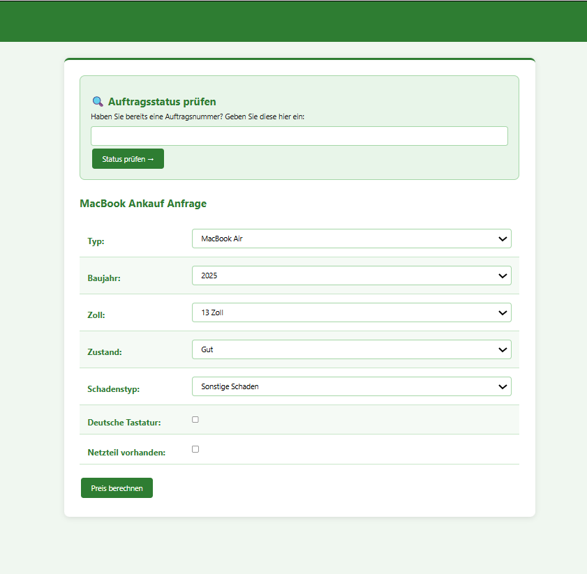
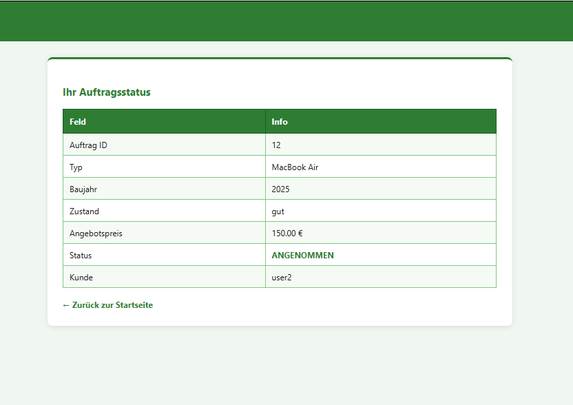
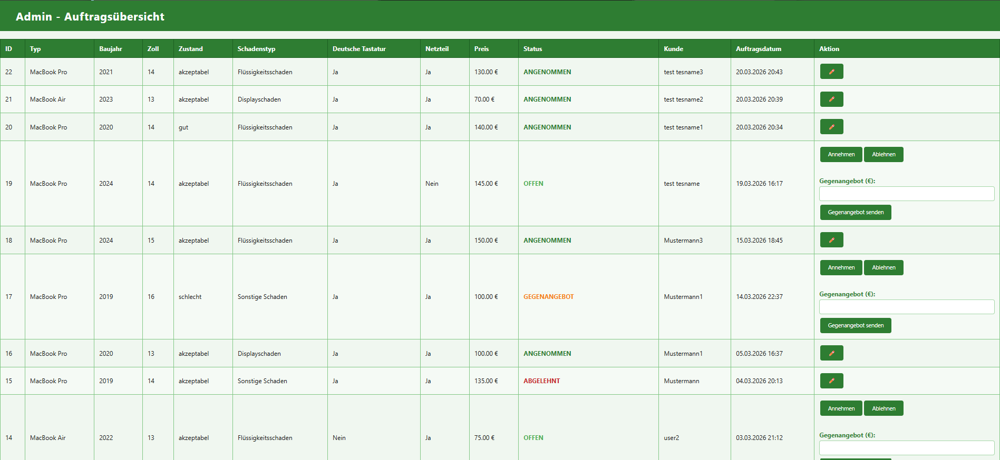

# Projekt Titel

**Notebooknerds-JEE**  
(Java-EE-Hochschulprojekt zur Digitalisierung eines MacBook-Ankaufsystems)

---

# Beschreibung

Notebooknerds-JEE ist ein Hochschulprojekt im Bereich Java Enterprise Edition (Java EE), das im Rahmen eines Studienprojekts entwickelt wurde.

Ziel der Anwendung ist die Digitalisierung und Automatisierung eines MacBook-Ankaufsprozesses für einen Reparatur- und Refurbishment-Service.

Die Webanwendung ermöglicht es Kunden, Informationen zu ihrem Gerät einzugeben, automatisch einen Ankaufspreis berechnen zu lassen und anschließend eine Ankaufanfrage zu erstellen.

Administratoren können eingegangene Aufträge verwalten, Angebote prüfen und den Status der Geräte aktualisieren.

Das Projekt kombiniert moderne Java-EE-Technologien wie JSF, CDI, EJB und JPA mit einer MySQL-Datenbank und einem Payara-Application-Server.

---

# Features

- Automatische Preisberechnung für MacBooks
- Erstellung von Ankaufanfragen
- Admin-Bereich zur Auftragsverwaltung
- Statusverwaltung für Geräte und Aufträge
- Speicherung der Daten in MySQL
- Java-EE-Architektur mit JSF, CDI, EJB und JPA
- Formularvalidierung und Benutzerinteraktion
- Datenbankanbindung über JPA / Persistence API
- Deployment über Payara Server
- Mehrschichtige Architektur (UI, Business-Logic, Persistence)

---

# Technologien

| Bereich | Technologie |
|---|---|
| Programmiersprache | Java |
| Frontend | JSF (JavaServer Faces), XHTML |
| Backend | Java EE |
| Business Logic | EJB |
| Dependency Injection | CDI |
| Datenbankzugriff | JPA |
| Datenbank | MySQL |
| Application Server | Payara Server |
| Build & Deployment | EAR Deployment |
| IDE | Eclipse IDE for Enterprise Java Developers |

---

# Projektstruktur

| Ordner / Datei | Beschreibung |
|---|---|
| `src/main/java` | Java-Klassen, Beans, Services und Geschäftslogik |
| `src/main/webapp` | XHTML-Seiten und Weboberfläche |
| `sql` | SQL-Dateien für die Datenbank |
| `deploy` | Deployment-Dateien |
| `screenshots` | Screenshots der Anwendung |
| `Dokumentation_notebooknerds.pdf` | Projektdokumentation |
| `Praesentation_notebooknerds.pdf` | Präsentation des Projekts |

---

# Screenshots / Demo

Hier ein kurzer Einblick in die Notebooknerds-JEE-Webanwendung:

| Ankauf | Auftragsstatus | Auftragsübersicht |
|---|---|---|
|  |  |  |

1. **Ankauf:** Formular zur Erstellung einer MacBook-Ankaufsanfrage mit automatischer Preisberechnung.  
2. **Auftragsstatus:** Statusseite, auf der Kunden den aktuellen Bearbeitungsstand ihres Auftrags prüfen können.  
3. **Auftragsübersicht:** Admin-Bereich zur Verwaltung eingegangener Aufträge mit Statusänderungen und Gegenangeboten.

---

# Architektur & Tech Stack

| Schicht | Technologie | Zweck |
|---|---|---|
| UI | JSF / XHTML | Benutzeroberfläche |
| Backend | Java EE | Geschäftslogik |
| Business Layer | EJB | Verarbeitung der Ankaufprozesse |
| Dependency Injection | CDI | Verwaltung von Beans |
| Persistence | JPA | Datenbankzugriffe |
| Datenbank | MySQL | Speicherung der Aufträge |
| Server | Payara Server | Hosting und Deployment |
| Deployment | EAR-Datei | Bereitstellung der Anwendung |

---

# Installation

## 1. Projekt importieren

Projekt in Eclipse IDE for Enterprise Java Developers importieren.

Beispielpfad:

```text
C:\Users\Elene\eclipse-workspace\notebooknerds
```

## 2. Payara Server starten

Payara Server in Eclipse hinzufügen und starten.

Die Anwendung wird über den lokalen Application Server ausgeführt.

Standard-Adresse:

```text
http://localhost:8080
```

## 3. Datenbank vorbereiten

Die Anwendung nutzt eine MySQL-Datenbank.

Die SQL-Datei befindet sich im Ordner:

```text
sql/
```

Import über phpMyAdmin oder MySQL Workbench möglich.

phpMyAdmin:

```text
http://localhost/phpmyadmin
```

## 4. Projekt deployen

Das Projekt als EAR-Datei auf Payara deployen.

Anschließend im Browser öffnen:

```text
http://localhost:8080/notebooknerds
```

---

# Usage & Testing

## Usage

Die Anwendung ermöglicht folgende Funktionen:

- Erstellung von Ankaufanfragen
- Automatische Preisermittlung
- Verwaltung von Aufträgen
- Bearbeitung des Auftragsstatus
- Anzeige von Geräteinformationen
- Administrationsfunktionen über den Adminbereich

Die Kommunikation zwischen Benutzeroberfläche, Business-Logic und Datenbank erfolgt über Java-EE-Komponenten wie JSF, CDI, EJB und JPA.

---

## Testing

Das Projekt wurde während der Entwicklung manuell getestet.

Getestet wurden insbesondere:

- Formularvalidierungen
- Preisberechnung
- Datenbankzugriffe
- Speicherung von Aufträgen
- Navigation zwischen den Seiten
- Admin-Funktionen
- Deployment auf Payara
- Verbindung zwischen Frontend und Backend

Zusätzlich wurden Fehler mithilfe der Eclipse-Konsole, Server-Logs und schrittweisem Debugging analysiert und behoben.

---

# Dokumentation

Die vollständige Projektdokumentation sowie die Präsentation befinden sich im Repository:

- `Dokumentation_notebooknerds.pdf`
- `Praesentation_notebooknerds.pdf`

---

# Contributing

Beiträge und Verbesserungsvorschläge sind willkommen.

1. Repository forken
2. Eigenen Branch erstellen
3. Änderungen durchführen
4. Änderungen committen
5. Änderungen pushen
6. Pull Request erstellen

Beispiel:

```bash
git checkout -b feature/neues-feature
git commit -m "Neue Funktion hinzugefügt"
git push origin feature/neues-feature
```

---

# License

Dieses Projekt wurde im Rahmen eines Hochschulprojekts entwickelt und dient ausschließlich Lern-, Demonstrations- und Präsentationszwecken.

---

# Author

**Kakha Tsimakuridze**  
Wirtschaftsinformatik – Hochschulprojekt  
Java EE / Webentwicklung / Datenbanksysteme
